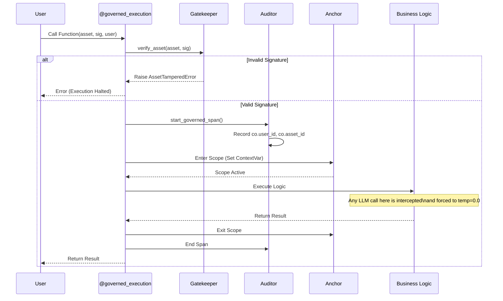

# Architecture Deep Dive

`coreason_veritas` is architected as a **non-negotiable governance middleware**. It does not merely observe AI execution; it intervenes to enforce deterministic behavior and cryptographic integrity.

## The Core Philosophy: "Sandwich Execution"

The system operates on a "Sandwich" model (Governed -> Ungoverned -> Governed) to ensure that the "Safety Anchor" context persists through layers of execution, even if intermediate code is not explicitly governed.

1.  **Top Layer (Governed):** The entry point is verified by the **Gatekeeper**. The **Anchor** is set.
2.  **Middle Layer (Ungoverned):** Business logic runs. Calls to external LLMs happen here.
3.  **Bottom Layer (Governed/Observed):** The **Anchor** (via `DeterminismInterceptor`) intercepts LLM calls to enforce parameters (`temperature=0.0`).

## The Three Pillars

### 1. The Gatekeeper (Cryptographic Verification)

*   **Role:** Prevents unauthorized code execution.
*   **Mechanism:** It validates the input "Asset" (Agent Spec) against a digital signature provided by the Scientific Review Board (SRB).
*   **Failure Mode:** If the signature is invalid, it raises `AssetTamperedError` immediately. No code runs.

### 2. The Auditor (Immutable Execution Record)

*   **Role:** Creates a forensic audit trail.
*   **Mechanism:** Uses OpenTelemetry to generate a Span for the execution.
*   **Mandatory Attributes:**
    *   `co.user_id`: Who initiated it.
    *   `co.asset_id`: What code is running.
    *   `co.srb_sig`: The proof of authorization.
    *   `co.determinism_verified`: Boolean flag confirming the Anchor was active.

### 3. The Anchor (Determinism Enforcement)

*   **Role:** Eliminates stochastic behavior ("Hallucinations").
*   **Mechanism:** Uses Python `contextvars` to maintain a thread-safe scope.
*   **The "Lobotomy Protocol":** Inside this scope, the `DeterminismInterceptor` forcibly sets:
    *   `temperature = 0.0`
    *   `top_p = 1.0`
    *   `seed = 42` (configurable via `VERITAS_SEED`)

## System Flow Diagram

## The "Blast Radius" Pattern

In deeply nested executions, `coreason_veritas` adheres to a "Blast Radius" error handling strategy:

*   **Inner Failure:** If a nested governed function fails (e.g., signature verification fails for a sub-component), the failure is recorded in its own span.
*   **Propagation:** The exception propagates up to the caller.
*   **Outer Integrity:** The outer span records the exception but maintains its own integrity as a valid execution record of a failed attempt.
